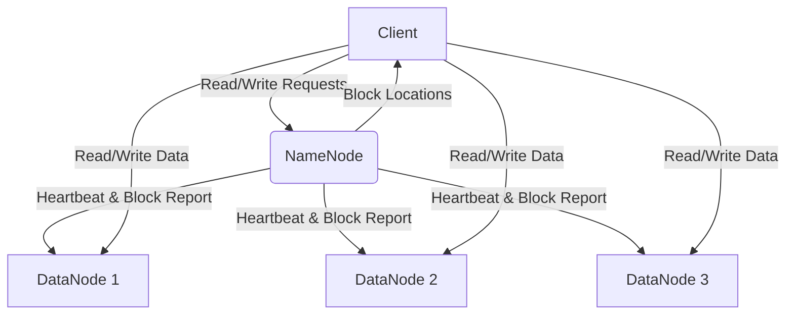

# HDFS: Hadoop Distributed File System

## Overview

HDFS (Hadoop Distributed File System) is a distributed file system designed to run on commodity hardware. It is highly fault-tolerant and designed to be deployed on low-cost hardware.

> [!quote] 
> "HDFS is a filesystem designed for storing very large files with streaming data access patterns running on clusters of commodity hardware."

## Key Characteristics

1. **Very Large Files**: Supports file sizes from megabytes to petabytes.
2. **Streaming Data Access**: Built around the "write-once, read-many-times" pattern.
3. **Commodity Hardware**: Doesn't require expensive, highly reliable hardware.

## HDFS Concepts

### Blocks

- The minimum amount of data that HDFS can read or write.
- Typical block size: 128MB (configurable).

#### Advantages of Blocks
1. Files can be larger than any single disk in the network.
2. Simplifies the storage subsystem (no metadata or file permissions at block level).
3. Facilitates replication for fault tolerance.

### NameNodes and DataNodes

HDFS cluster operates in a master-worker pattern:

#### NameNode (Master)
- Manages the filesystem namespace.
- Maintains the filesystem tree and metadata for all files and directories.
- Knows the DataNodes on which all the blocks for a given file are located.
- Does not store block locations persistently.

#### DataNodes (Workers)
- Store and retrieve blocks.
- Report back to the NameNode with lists of blocks they are storing.

> [!important]
> The filesystem cannot function without the NameNode, making it a critical point of failure.

### HDFS Architecture

## Advantages of HDFS

1. **Scalability**: Can scale to store and process petabytes of data.
2. **Fault Tolerance**: Automatically replicates data across multiple nodes.
3. **Flexibility**: Can be used with various data processing frameworks (MapReduce, Spark, etc.).
4. **Cost-Effective**: Runs on commodity hardware, reducing infrastructure costs.

## Limitations of HDFS

1. **Low-Latency Data Access**: Not suitable for applications requiring real-time data access.
2. **Small File Storage**: Inefficient for storing many small files due to NameNode memory limitations.
3. **Multiple Writers**: Lacks support for multiple writers to the same file.

## NameNode Resilience

Given the critical nature of the NameNode, several strategies are employed to ensure its resilience:

1. **Backup Systems**: Regular backups of the filesystem metadata.
2. **Secondary NameNode**: Periodically merges the namespace image with the edit log to prevent the edit log from becoming too large.
3. **High Availability (HA) Mode**: Configures a pair of NameNodes in an Active/Passive configuration.

## Use Cases

HDFS is well-suited for:
- Large-scale data analytics
- Data warehousing
- Backup and archiving of large datasets
- Streaming media storage and processing